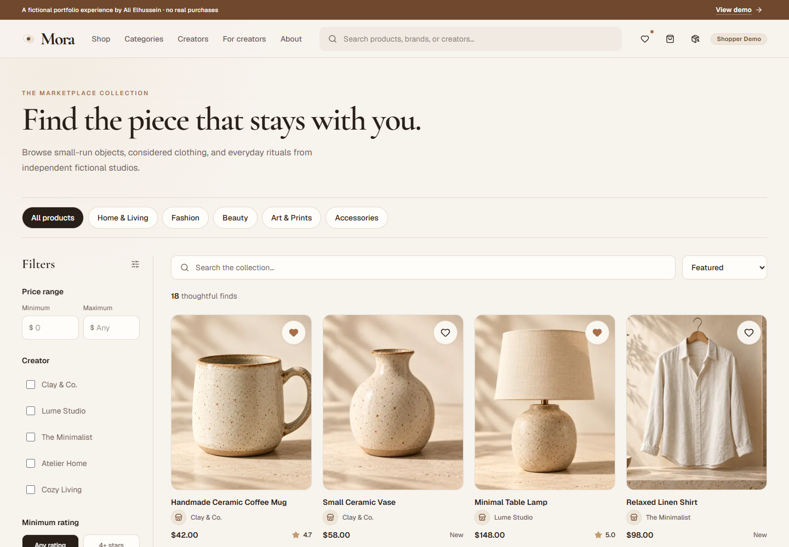
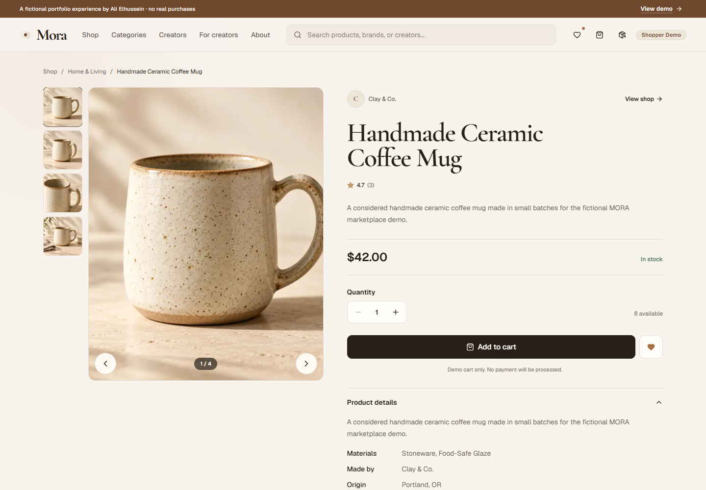
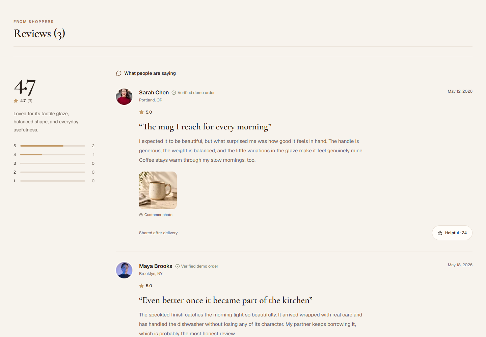
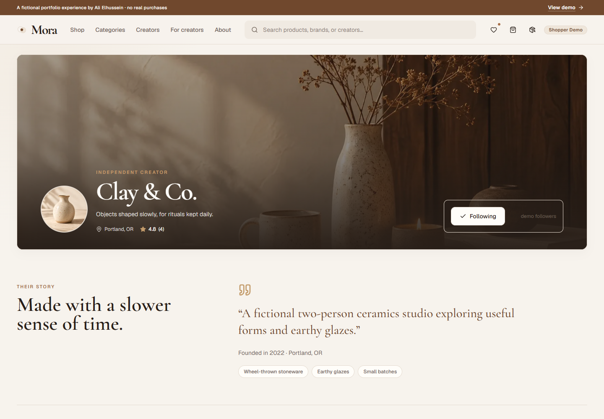
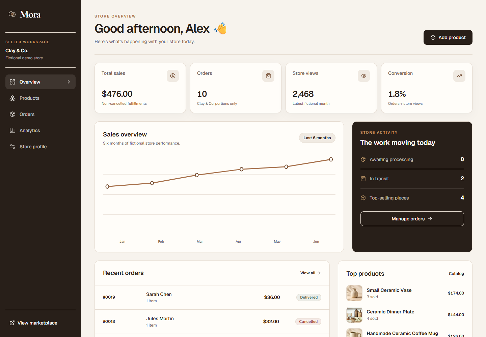
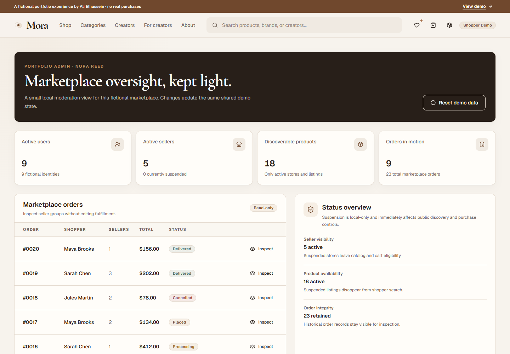
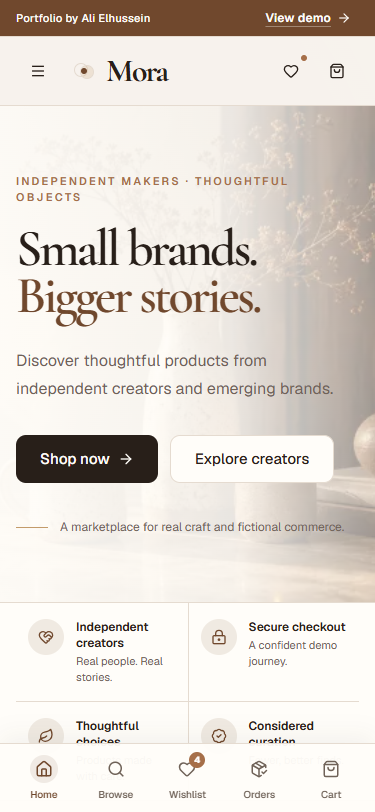
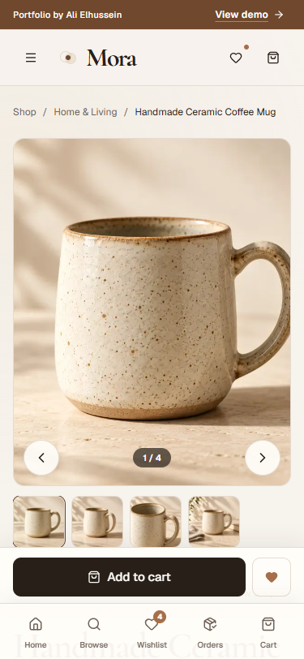

# MORA — Curated multi-vendor marketplace

MORA is a premium interactive marketplace portfolio experience for independent makers and emerging brands. It demonstrates a complete fictional commerce lifecycle across shopper, seller, and admin roles—without a backend or real transactions.

**[Explore the live demo](https://mora-wheat.vercel.app)**


## A marketplace that feels lived in

The public experience combines editorial storytelling with practical product discovery: category browsing, live search and filtering, wishlists, rich product galleries, seller storefronts, multi-seller cart groups, and a polished mock checkout.



## Product detail, not a template

Product pages prioritize material, maker identity, imagery, stock-aware purchasing, and customer context. Reviews come from delivered fictional demo orders and include rating distribution, customer photography, verified-order context, and helpful feedback.





## One state, three perspectives

- **Shopper:** discover, wishlist, add to cart, complete a mock checkout, track seller fulfillments, and review delivered products.
- **Seller:** publish products, manage variants and inventory, update store identity, inspect analytics, and advance only their own fulfillment groups.
- **Admin Lite:** inspect marketplace activity and suspend or reactivate sellers and products without introducing enterprise complexity.

Seller changes appear in the shopper catalog. Shopper orders appear in the correct seller workspace. Fulfillment updates flow back to shopper tracking. Admin suspension immediately affects purchase eligibility.







## Intentionally responsive

Mobile layouts are composed for touch rather than compressed from desktop. Navigation, product galleries, purchase actions, checkout, operational cards, and dense management views adapt around 375px while retaining MORA's warm editorial identity.

<p align="center">
  
  &nbsp;&nbsp;&nbsp;
  
</p>

## Technical foundation

- Next.js App Router, TypeScript, and Tailwind CSS
- Centralized persisted Zustand marketplace state
- Deterministic fictional seed data and one-click demo reset
- Seller-scoped fulfillment groups inside multi-vendor orders
- Historical order pricing and stock-aware cart validation
- Responsive `next/image` assets, semantic controls, visible focus, and reduced-motion support

## Run locally

```bash
npm install
npm run dev
```

Then open `http://localhost:3000`.

Product rules and architecture live in [`docs/MORA_SPEC.md`](docs/MORA_SPEC.md). The visual source of truth lives in [`design-system/mora/MASTER.md`](design-system/mora/MASTER.md).

---

MORA is a fictional portfolio demonstration. No real purchases, payments, sellers, or customer data are used.

© 2026 Ali Elhussein. All rights reserved. See [`LICENSE.md`](LICENSE.md).
